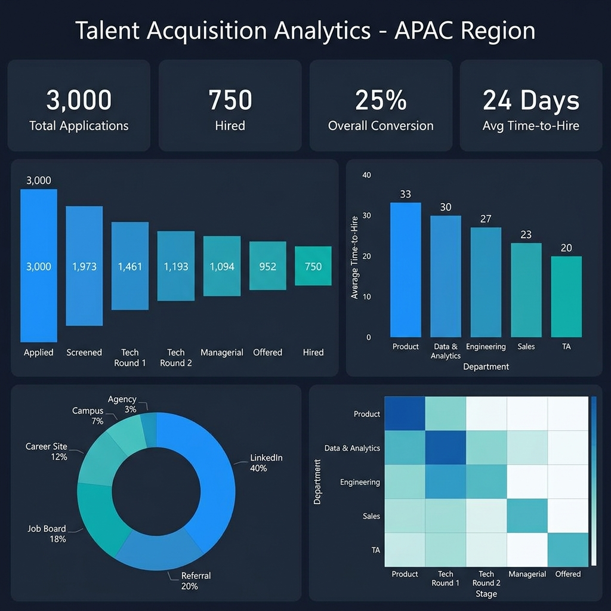

# Talent Intelligence Suite

An end-to-end Talent Acquisition analytics pipeline built with Python, SQL, and Power BI. Covers the full recruitment data lifecycle — from candidate data ingestion and relational analysis to GitHub profile sourcing, resume screening, and dashboard visualization across the APAC region.

## Dashboard Preview



## Tech Stack

| Layer | Technology |
|-------|-----------|
| Data Engineering | Python, Faker (data seeding) |
| Database | SQLite3 |
| SQL Analytics | 8 production queries (funnel, bottleneck, ROI, trends) |
| Visualization | Power BI (DAX measures), exported screenshots |
| GitHub API | Python requests, pagination, rate-limit handling |
| Resume Matching | pdfplumber, regex-based skill taxonomy, weighted scoring |
| Version Control | Git |

## Project Structure

```
talent-intelligence-suite/
├── scripts/
│   ├── generate_data.py        # Seeds 3,000 candidate records into SQLite
│   ├── execute_queries.py      # 8 SQL analytics queries → CSV reports
│   ├── github_fetcher.py       # GitHub REST API fetcher with retry logic
│   ├── score_calculator.py     # Activity + diversity scoring engine
│   └── resume_matcher.py       # JD-resume matching with weighted taxonomy
├── data/
│   └── talent_analytics.db     # SQLite database
├── reports/
│   ├── 01_funnel_conversion_rates.csv
│   ├── 02_avg_time_to_hire_by_department.csv
│   ├── 03_source_roi_analysis.csv
│   ├── 04_stage_bottleneck_duration.csv
│   ├── 05_offer_acceptance_rate_by_dept.csv
│   ├── 06_quality_score_vs_outcome.csv
│   ├── 07_department_stage_heatmap.csv
│   ├── 08_monthly_application_trend.csv
│   ├── candidate_match_ranking.csv
│   └── powerbi_dashboard.png
├── sample_resumes/             # 5 resumes for matcher testing (.txt)
├── schema_diagram.md           # Mermaid ER diagram
├── requirements.txt
└── README.md
```

## Setup

```bash
pip install -r requirements.txt
```

## Usage

### 1. Seed Candidate Data (3,000 Records)

```bash
python scripts/generate_data.py
```

Populates the database with 3,000 candidate records modeled on realistic recruitment funnel logic:
- **5 departments** with distinct drop-off rates and time-to-hire profiles
- **6 sourcing channels** weighted by real-world distribution
- **7-stage pipeline**: Applied → Screened → Tech Round 1 → Tech Round 2 → Managerial → Offered → Hired
- Quality scores (40-100) influence stage progression probability

### 2. Run SQL Analytics (8 Queries)

```bash
python scripts/execute_queries.py
```

Produces 8 CSV reports covering:

| Query | Business Question |
|-------|------------------|
| Funnel Conversion | What % of applicants reach each stage? |
| Time-to-Hire | Which departments hire fastest/slowest? |
| Source ROI | Which channels produce the most hires per applicant? |
| Stage Bottlenecks | Where do candidates spend the most time? |
| Offer Acceptance | Which departments lose candidates at the offer stage? |
| Quality vs Outcome | Do higher-scored candidates actually get hired more? |
| Dept Heatmap | How does each department's funnel compare? |
| Monthly Trend | How are applications and hires trending over time? |

### 3. Fetch GitHub Profiles

```bash
export GITHUB_TOKEN=ghp_your_token_here
python scripts/github_fetcher.py username1 username2
```

Features:
- Full pagination support (up to 300 repos per user)
- Rate-limit detection with automatic back-off
- Retry logic with exponential backoff (3 attempts)
- Stores profiles, repos, and language distributions in SQLite

### 4. Compute GitHub Scores

```bash
python scripts/score_calculator.py
```


Computes two normalized (1-100) scores:
- **Activity Score**: Repo count, total stars, total forks, and recency of last push
- **Diversity Score**: Shannon entropy over programming language byte distribution

### 5. Match Resumes to JD

```bash
python scripts/resume_matcher.py                          # batch mode (sample_resumes/)
python scripts/resume_matcher.py path/to/resume.pdf       # single file
python scripts/resume_matcher.py path/to/resume_folder/   # custom folder
```

Skill taxonomy mirrors the Lenovo TA Intern JD:

| Category | Skills | Weight |
|----------|--------|--------|
| **Must-Have** | Excel, SQL, Power BI, Data Visualization, Automation, AI/ML Basics, Analytical Skills, Technical Mindset | 80 pts |
| **Good-to-Have** | Agent-Based Systems, Data Pipelines, Python, TA Analytics | 20 pts |

## Power BI Setup

### Connecting to the Data

1. Open Power BI Desktop → Get Data → SQLite (or use CSV files from `reports/`)
2. Load the `candidates` and `stage_transitions` tables
3. Create relationships: `candidates.id` → `stage_transitions.candidate_id`

### DAX Measures

**Conversion Rate (Applied to Hired)**:
```dax
Conversion Rate =
DIVIDE(
    CALCULATE(COUNTROWS(candidates), candidates[current_stage] = "Hired"),
    COUNTROWS(candidates),
    0
) * 100
```

**Weighted Time-to-Hire (experience-adjusted)**:
```dax
Weighted TTH =
SUMX(
    candidates,
    candidates[time_in_pipeline_days] *
    IF(candidates[experience_years] >= 5, 1.2, 1.0)
) / COUNTROWS(candidates)
```

## Key Insights

### 1. Talent Acquisition hires 4× faster than Product

TA department averages **20 days** to hire vs Product at **33 days**. The bottleneck for Product sits between Screened → Tech Round 1 (avg 7 days), suggesting the technical assessment scheduling process needs optimization. Recommendation: implement structured interview slots with pre-booked panelists for Product roles.

### 2. Quality score is a strong predictor of hiring outcome

Candidates scoring 80+ have a **39.2% hire rate** compared to just **11.1%** for those below 60. The high-quality tier also stays in the pipeline longer (14.3 vs 6.5 days), indicating they progress through more stages rather than dropping early. This validates the scoring model and suggests aggressive fast-tracking for 80+ candidates would reduce time-to-hire without sacrificing quality.

### 3. Career Site punches above its weight on conversion

Despite contributing only 12% of total applications, Career Site achieves the **highest conversion rate at 27.1%** — outperforming LinkedIn (23.9%) which supplies 40% of volume. Candidates who actively seek out the company career page demonstrate higher intent. Recommendation: increase investment in career site SEO and employer branding content to grow this high-converting channel.

## Schema

See [schema_diagram.md](schema_diagram.md) for the complete ER diagram.

## License

MIT
