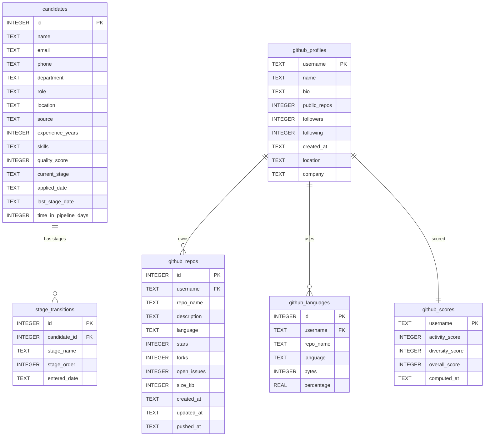

# Database Schema Diagram

## talent_analytics.db

## Table Descriptions

| Table | Records | Purpose |
|-------|---------|---------|
| `candidates` | 3,000 | Applicant profiles with department, source, quality score, and funnel stage |
| `stage_transitions` | ~10,400 | Every stage a candidate entered, with timestamps for bottleneck analysis |
| `github_profiles` | Variable | GitHub user metadata fetched via REST API |
| `github_repos` | Variable | Non-fork repositories per user with stars, forks, and language |
| `github_languages` | Variable | Per-repo language byte distribution for diversity scoring |
| `github_scores` | Variable | Computed activity and diversity scores (1-100 scale) |
